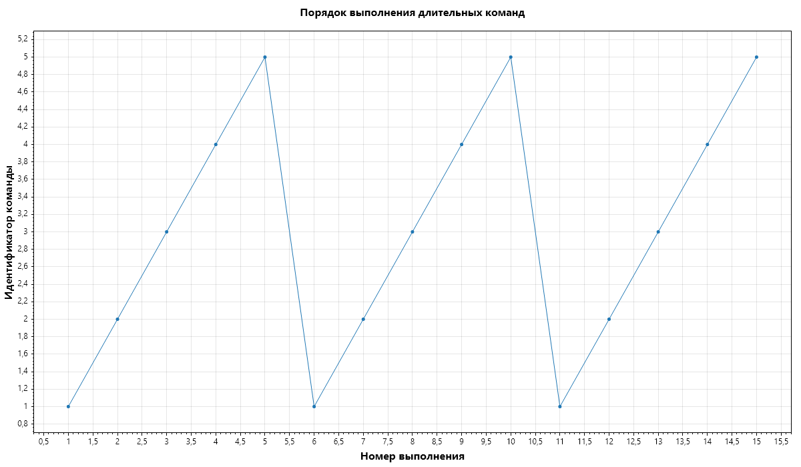
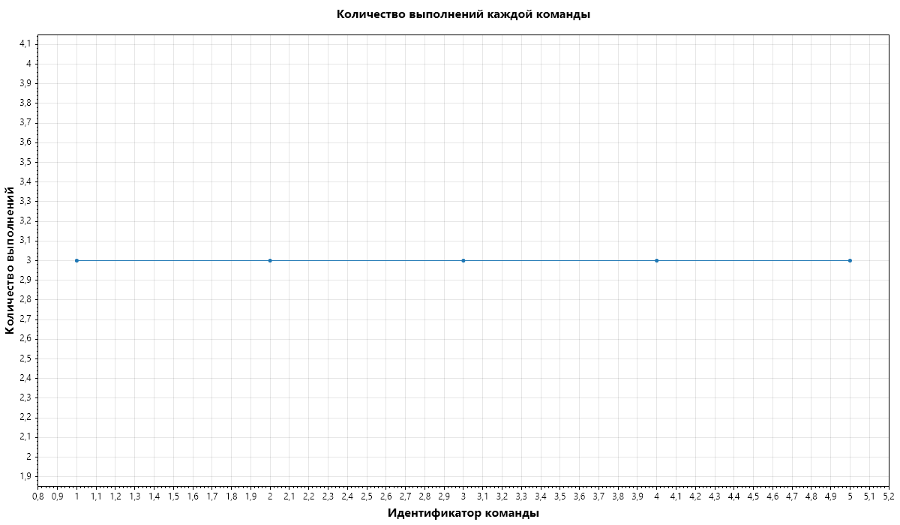

# Отчёт по задаче №19

## Реализация длительных операций

### Цель работы

Целью работы является предоставление возможности выполнения команд, для полного завершения которых требуется более одного вызова метода Execute().

### Реализация

Для демонстрации работы планировщика была реализована команда TestCommand. Команда хранит собственный счётчик выполнений. После каждого вызова Execute() она либо завершает работу, либо повторно добавляет себя в RoundRobinScheduler.

В эксперименте использовано 5 экземпляров TestCommand. Каждая команда должна была выполнить 3 вызова Execute().

Таким образом, общее количество выполнений составило 15.

Для выбора следующей команды использовалась циклическая стратегия Round Robin. После завершения всех требуемых выполнений в очередь ServerThread добавлялась команда HardStop.

### Результаты эксперимента

Фактически выполнено команд: 15.

Количество выполнений каждой команды:

| Команда | Количество выполнений |
|---:|---:|
| 1 | 3 |
| 2 | 3 |
| 3 | 3 |
| 4 | 3 |
| 5 | 3 |

Порядок выполнения команд:

| Номер выполнения | Команда | Номер вызова |
|---:|---:|---:|
| 1 | 1 | 1 |
| 2 | 2 | 1 |
| 3 | 3 | 1 |
| 4 | 4 | 1 |
| 5 | 5 | 1 |
| 6 | 1 | 2 |
| 7 | 2 | 2 |
| 8 | 3 | 2 |
| 9 | 4 | 2 |
| 10 | 5 | 2 |
| 11 | 1 | 3 |
| 12 | 2 | 3 |
| 13 | 3 | 3 |
| 14 | 4 | 3 |
| 15 | 5 | 3 |

### Интерпретация результатов

Полученная последовательность выполнения демонстрирует чередование команд. Ни одна длительная команда не занимает поток на всё время своей работы.

После каждого вызова Execute() команда, если её работа ещё не завершена, снова добавляется в планировщик. Благодаря этому RoundRobinScheduler получает возможность выбрать другую команду.

Таким образом, пять длительных операций выполняются псевдопараллельно в одном потоке. На каждом шаге обрабатывается небольшая часть работы конкретной команды.

### Остановка выполнения

После выполнения пятнадцатого вызова Execute() в очередь ServerThread добавляется HardStop. Команда HardStop выполняется непосредственно серверным потоком и немедленно завершает его работу.

В результате все пять команд были выполнены ровно по три раза, после чего поток был корректно остановлен.

### Вывод

В ходе работы была продемонстрирована возможность выполнения длительных операций без монопольного использования потока одной командой. Использование планировщика Round Robin позволяет распределять время выполнения между несколькими командами.

Эксперимент подтвердил, что для реализации длительных операций достаточно разбить их выполнение на несколько вызовов Execute() и возвращать незавершённую команду в планировщик.

Графики эксперимента:

